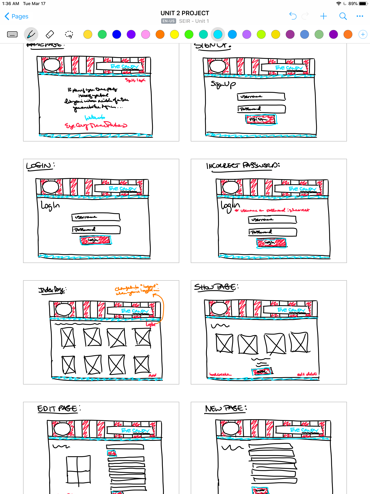

# crudapp

## About
Link to [Eye Candy Theme Parties](https://floating-badlands-60887.herokuapp.com/)

Cake decorating is one of my MANY hobbies and I tried to make a business out of it a few years back. I have a FB page and business cards - but I never had a website. So I was really excited to do that for this project. Because this site doesn’t have all of its layers yet - at this point, it is just selling the pre-made fondant decorations as a set - so you would order a plain cake from a bakery and add the decorations yourself. 

I'm very happy with the way everything turned out, but the red & white striped header graphic is my absolute pride and joy. I knew what I wanted, but couldn't just drop in a jpg, because it needed to be responsive. So I researched and taught myself about SVG (Scalable Vector Graphics). I had vector graphics in the design world, but I had no idea I had them here. I figured out how to create the exact pattern I wanted - and it scales beautifully.

----
## Technologies Used
* HTML
* CSS
* Node.js
* EJS
* Express
* Mongoose
* Bcrypt
* Method-Override
* EJS Partials

----
## Wireframes

